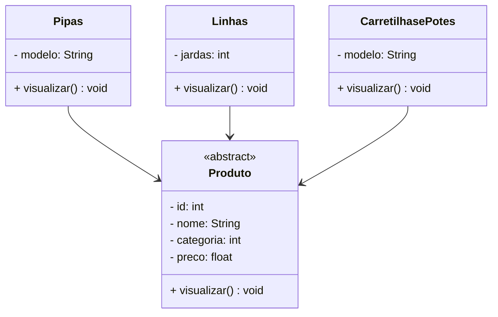

# Projeto Malvadão Pipas - Java  
<br />  
<div align="center">  
    
</div>  
<br />  
<div align="center">  
    
    
    
    
    
    
</div>  
------  
<br />  

## 1. Descrição  
O **Projeto Malvadão Pipas** é um sistema de gestão projetado para simular e administrar operações relacionadas à venda de pipas. Ele oferece funcionalidades como **cadastro**, **consulta**, **atualização** e **remoção** de produtos, além de gerenciar vendas e estoque.  

O sistema organiza informações dos produtos — incluindo nome, código, preço, quantidade em estoque e tipo de pipa — garantindo controle preciso e rápido das operações.  

Seu principal objetivo é automatizar o gerenciamento de vendas, facilitando o controle de estoque e melhorando a experiência do vendedor e do cliente.  

Este projeto, desenvolvido em **Java**, foca no estudo e aplicação dos conceitos de **Programação Orientada a Objetos (POO)**, incluindo:  
- Classes e Objetos;  
- Atributos e Métodos;  
- Modificadores de Acesso;  
- Herança e Polimorfismo;  
- Classes Abstratas;  
- Interfaces.  

Além de servir como um simulador funcional, o projeto oferece uma base prática para compreender os princípios fundamentais da POO aplicados a um cenário realista.  

## 2. Funcionalidades do Projeto  
1. **Cadastrar Pipa:** Adiciona um novo produto ao estoque, definindo nome, código, preço, quantidade e tipo de pipa.  
2. **Listar Todas as Pipas:** Exibe todos os produtos cadastrados no sistema.  
3. **Consultar Pipa por Código:** Localiza um produto específico pelo seu código.  
4. **Consultar Pipa por Nome:** Localiza um ou mais produtos pelo nome.  
5. **Editar Pipa:** Permite atualizar os dados de um produto existente.  
6. **Excluir Pipa:** Remove um produto do estoque com base no código.  
7. **Registrar Venda:** Realiza a venda de um produto, atualizando o estoque automaticamente.  
8. **Repor Estoque:** Adiciona quantidade ao estoque de um produto existente.  

## 3. Diagrama de Classes  
Um **Diagrama de Classes** é um modelo visual usado na programação orientada a objetos para representar a estrutura de um sistema. Ele exibe classes, atributos, métodos e os relacionamentos entre elas, como associações, heranças e dependências.  

Abaixo, o Diagrama de Classes do Projeto Malvadão Pipas: 


## 5. Requisitos

<br />

Para executar os códigos localmente, você precisará de:

- [Java JDK 17+](https://www.oracle.com/java/technologies/javase/jdk17-archive-downloads.html)
- [Eclipse](https://eclipseide.org/) ou [STS](https://spring.io/tools)

<br />

## 6. Como Executar o projeto no Eclipse/STS

<br />

### 6.1. Importando o Projeto
1. Clone o repositório do Projeto Final Bloco 01 (https://github.com/Rayssa-Ferraz/projeto_final_bloco_01)) dentro da pasta do *Workspace* do Eclipse/STS

```bash
git clone https://github.com/Rayssa-Ferraz/projeto_final_bloco_01
```

2. **Abra o Eclipse/STS** e selecione a pasta do *Workspace* onde você clonou o repositório do projeto
3. No menu superior do Eclipse/STS, clique na opção: **File 🡲 Import...**
4. Na janela **Import**, selecione a opção: **General 🡲 Existing Projects into Workspace** e clique no botão **Next**
5. Na janela **Import Projects**, no item **Select root directory**, clique no botão **Browse...** e selecione a pasta do Workspace onde você clonou o repositório do projeto
6. O Eclipse/STS reconhecerá automaticamente o projeto
7. Marque o Projeto Conta Bancária no item **Projects** e clique no botão **Finish** para concluir a importação

<br />

### 6.2. Executando o projeto

1. Na guia **Package Explorer**, localize o Projeto Conta Bancária
2. Abra a **Classe Menu**
3. Clique no botão **Run**  para executar a aplicação
4. Caso seja perguntado qual é o tipo do projeto, selecione a opção **Java Application**
5. O console exibirá o menu do Projeto.

<br />

## 7. Contribuição

<br />

Este repositório é parte de um projeto educacional, mas contribuições são sempre bem-vindas! Caso tenha sugestões, correções ou melhorias, fique à vontade para:

- Criar uma **issue**
- Enviar um **pull request**
- Compartilhar com colegas que estejam aprendendo Java!

<br />

##  8. Contato

<br />

Desenvolvido por [**Rayssa**](https://github.com/Rayssa-Ferraz)
Para dúvidas, sugestões ou colaborações, entre em contato via GitHub ou abra uma issue.
